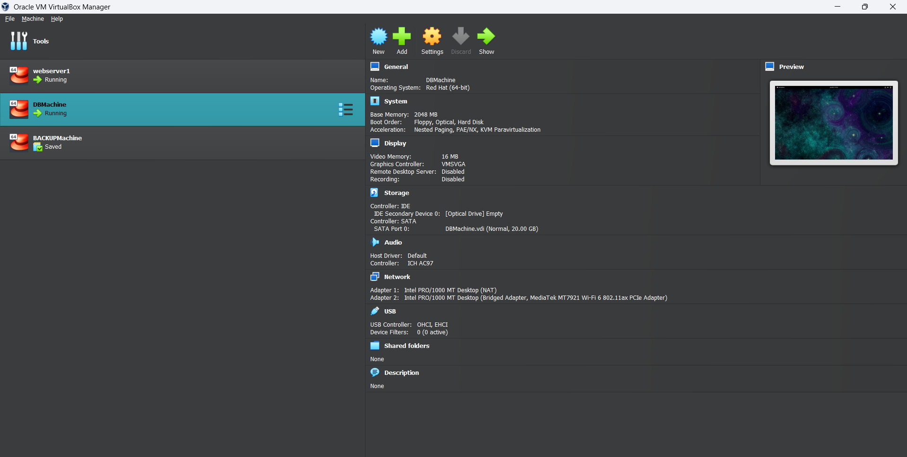
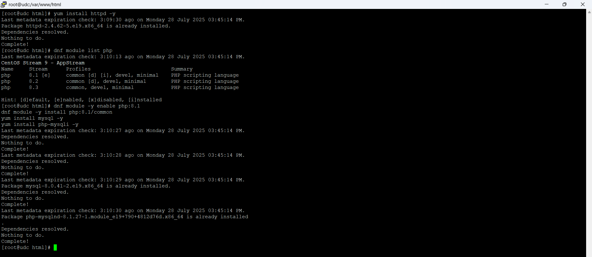
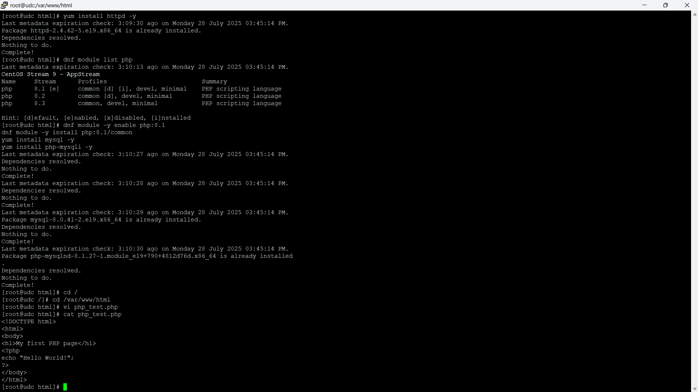
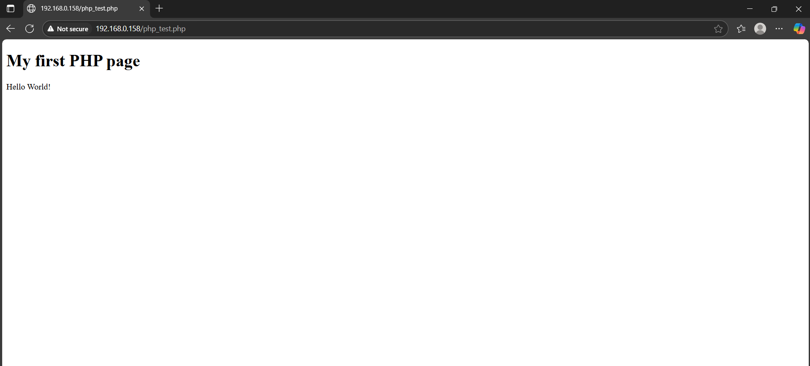
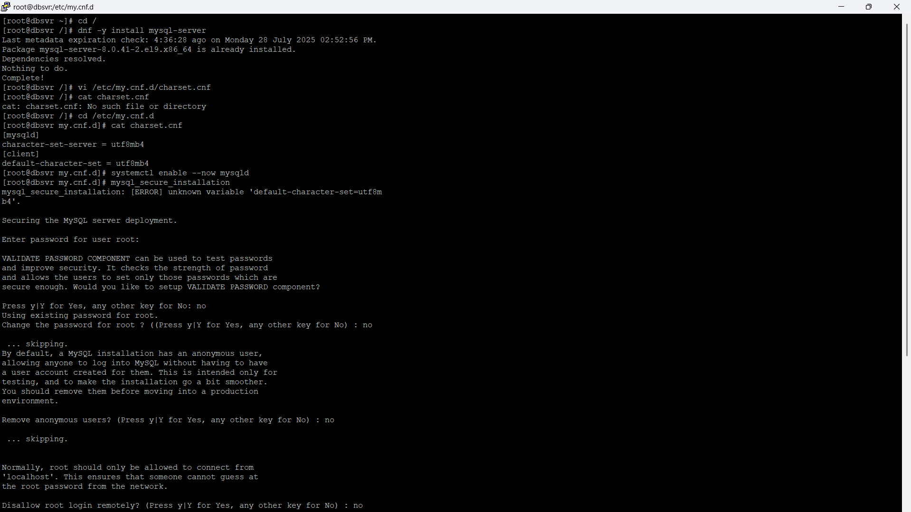
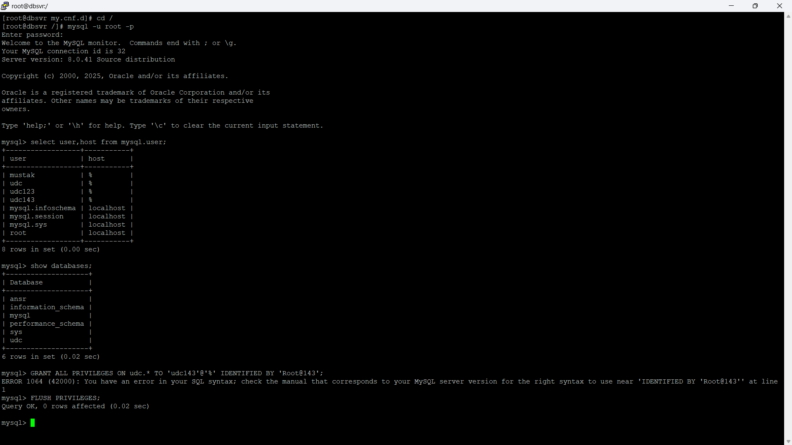
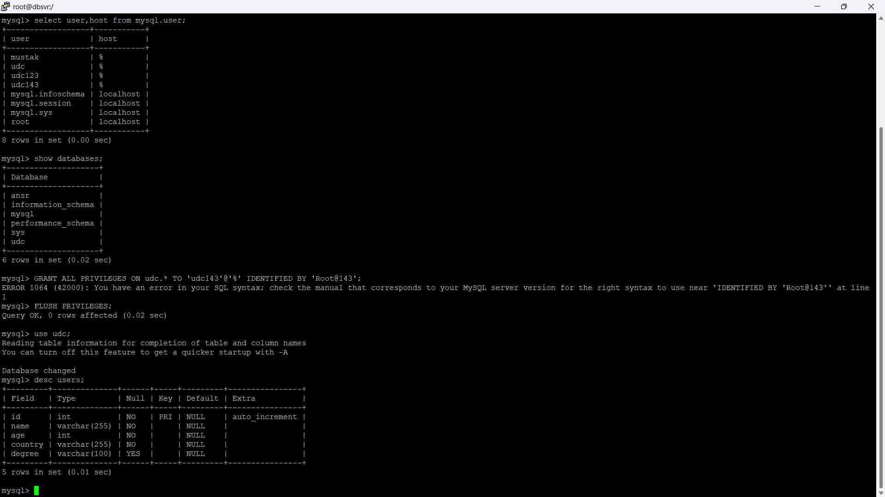
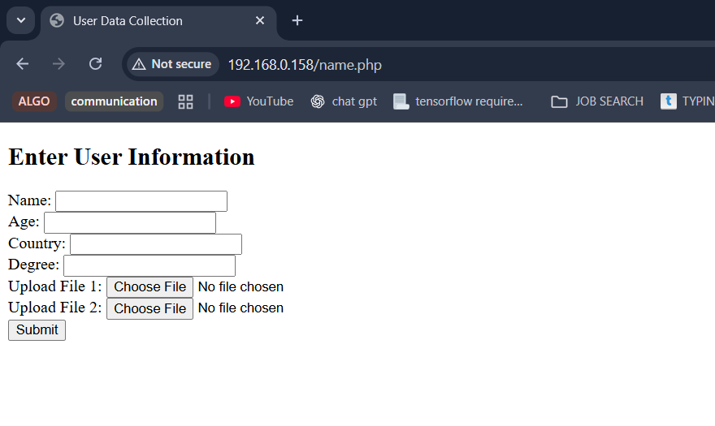
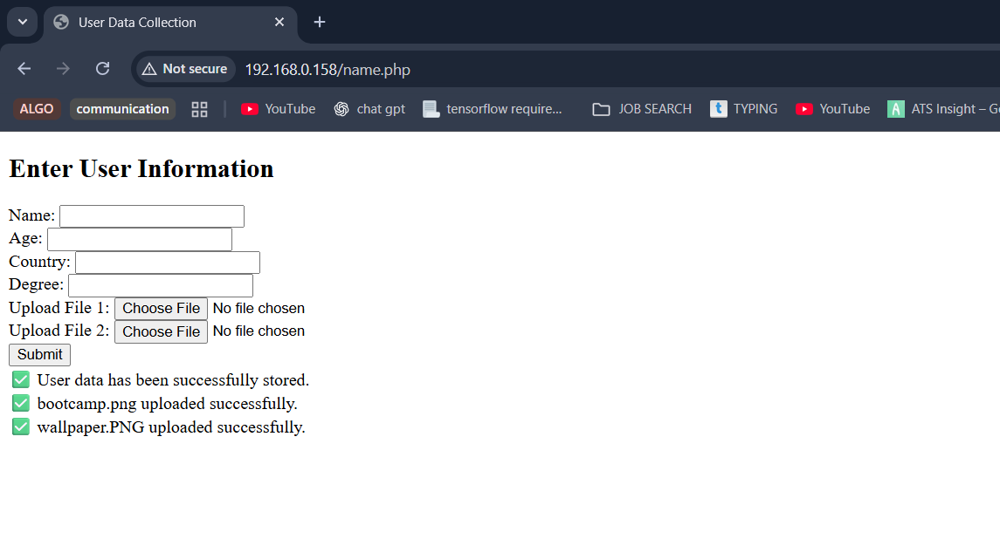
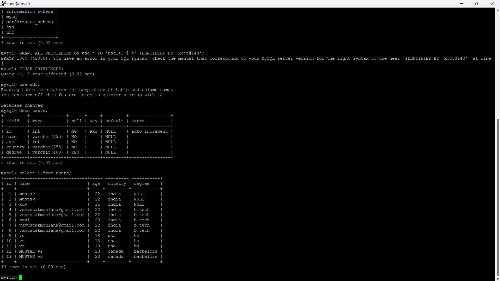

🗃️ **UDC Server: Step-by-Step Installation & Configuration Guide**

📖 **Project Overview**
The User Data Collector (UDC) is a PHP-based web application for securely collecting user data (name, age, country,Degree) and file uploads, saving them into a MySQL database. Deployed on two VMs: one as the web server, one as the database server.

⚙️ **Prerequisites**
<pre>2 CentOS 8/RHEL 8 VMs (Web and DB server)
Sudo/root privileges
Internet access</pre>

1️⃣ **Web Server Setup (Apache + PHP)**

Step 1 : Install Apache in Web Server 
<pre>
○ Command : yum install httpd -y 
○ Command : Set hostname as udc.example.com (using vi /etc/hostname we have to 
change permanently)</pre>

Step 2: Install PHP (and PHP-MySQL extension)

<pre>dnf module -y enable php:8.1
dnf module -y install php:8.1/common
yum install php-mysqli -y
php -v</pre>

Step 2 : Install PHP and other tools in Web Server 
<pre>
○ Commands : dnf module list php 
dnf module -y enable php:8.1 
dnf module -y install php:8.1/common 
yum install mysql -y 
yum install php-mysqli -y </pre>

Step 3 : Check the installed PHP version and enable httpd service 
<pre>
○ Command : php -v 
○ Command : systemctl enable --now httpd</pre>

Step 4 : Create a test page in 
Web Server 
<pre>
○ Commands : cd /var/www/html 
vi php_test.php</pre>

Incase if its not working – we need to stop the firewall of linux 
Commands :  
<pre>
i) setenforce 0 
ii) systemctl stop firewalld</pre>

2️⃣ **Database Server Setup (MySQL)**

Step 1 : Install MySQL Server in DB Server 
<pre>
○ Command : dnf -y install mysql-server 
</pre>

● Step 2 : Configure the character set in DB Server 
<pre>
○ Command : vi /etc/my.cnf.d/charset.cnf 
○ Insert below in the same file 
[mysqld] 
character-set-server = utf8mb4 
[client] 
default-character-set = utf8mb4 
</pre>
● Step 3 : Enable the Mysql Service in DB Server 
<pre>
○ Command : systemctl enable --now mysqld 
</pre>
● Now configure the Database in DB Server
<pre>
○ Command : mysql_secure_installation 
</pre>

After the setup, use below command to login to MySQL in DB Server 
<pre>
○ Command 1 : mysql -u root -p 
○ Command 2 : select user,host from mysql.user; 
○ Command 3 : show databases;
</pre>

step 4:
<pre>
CREATE DATABASE udc;
CREATE USER 'udc'@'%' IDENTIFIED BY 'Welcome@123';
GRANT ALL PRIVILEGES ON udc.* TO 'udc'@'%';
exit;
</pre>

Step 5: Test Remote MySQL Access from Web Server
<pre>mysql -h <DB-SERVER-IP> -u udc -p</pre>

3️⃣ **UDC Application Configuration**

Step 1: Create users Table
<pre>
From MySQL shell on DB server:

sql
USE udc;
CREATE TABLE users (
  id INT AUTO_INCREMENT PRIMARY KEY,
  name VARCHAR(100),
  age INT,
  country VARCHAR(100),
  file VARCHAR(255)
);
</pre>

Step 9: Upload Directory on Web Server
<pre>
mkdir -p /var/udc/uploads
chmod -R 777 /var/udc
ls -ld /var/udc/uploads
</pre>

Step 10: Deploy and Use UDC main.php
<pre>
Edit /var/www/html/main.php (see earlier for code).
In browser, visit: http://<Web-Server-IP>/main.php
</pre>

Fill out the form and submit.

